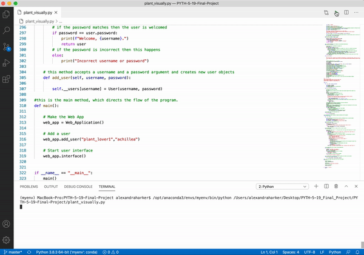
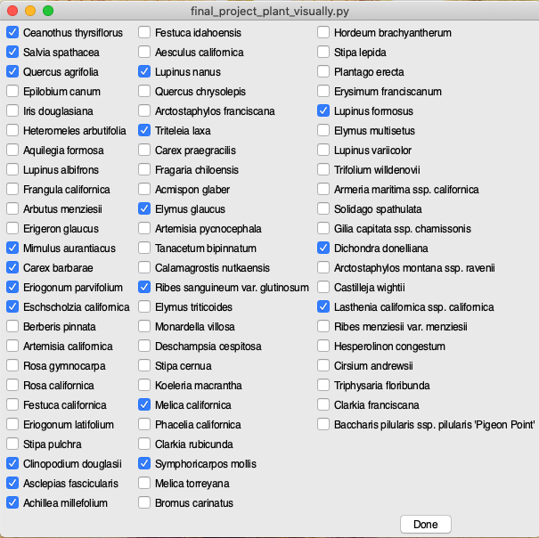
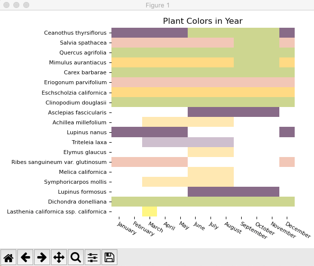
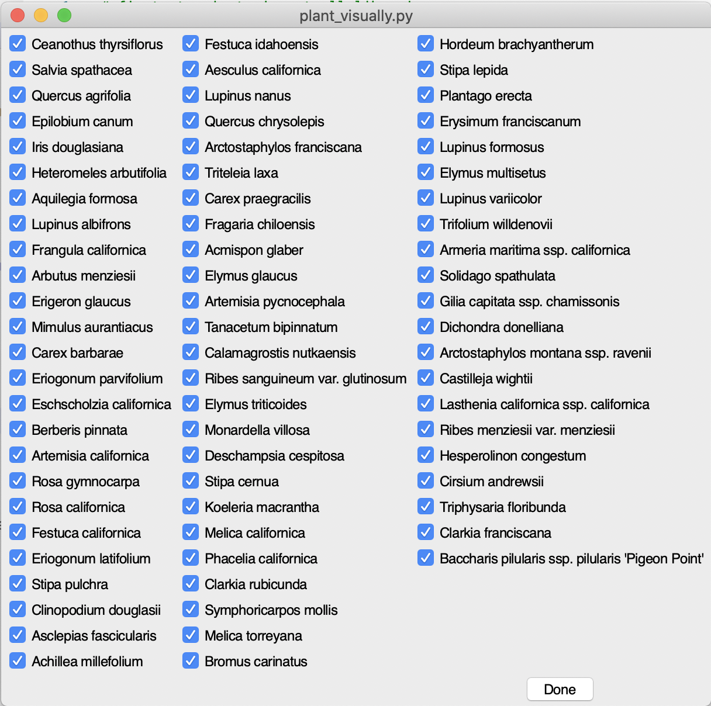
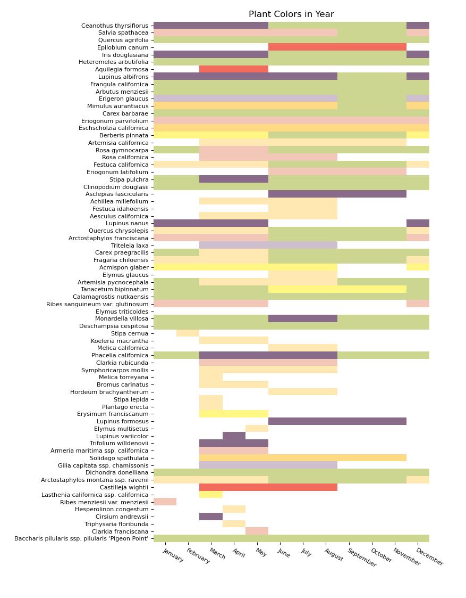

# Plant Visually

**NOTE: to use the application without creating a new user, login with the username "plant_lover1" and the password "achillea"**

## Summary

This project allows users to generate a visualization based on data from a list of plants they select. This project focuses on plants that are tolerant of or adapted to serpentine soils and that are native to the Potrero Hill Neighborhood in San Francisco. This tool was used to develop the planting plan for the [Eco-Patch Test Garden](https://field-collective.land/blog/) project, which seeks to encourage people to use native plants with high habitat and biodiversity value. In the future, this tool will be provided as part of an outreach effort as a way to further engage people with the Eco-Patch plants. The intention is that this tool, in conjunction with physical Eco-Patch garden, will help people figure out which combinations of plants provide year-round interest in the form of flowers or green foliage and make them more inclined to use these native plants. The beta version of this application can be found [here](https://github.com/hackerharker/Plant-Visually_Beta-Version).

## Data 

The application uses a plant data set from [Calscape](https://calscape.org/) that was downloaded as a spreadsheet and saved as a .csv file. Although this data set is a limit number of plants based on a small geographic region that are adapted to or tolerant of serpentine soils, because it works with Calscape data it has potential to be scaleable. In order to make the application print a color associated with the flower season, a column of RGB values corresponding to flower color was added to the spreadsheet prior to briging it into pandas.

## Libraries

* pandas- used for loading, storing and filtering data
* MatPlotLib- a heatmap that maps a number to a color was used to generate the chart
* Numpy- used to create an index of the colors for the MatPlotLib heatmap
* appJar- for the web application class GUI checkboxes

## Functional Components

**Data Processing Class**- This class reads in a .csv file from [Calscape](https://calscape.org/) and uses pandas to filter the data as needed to create the chart. I am specifically interested in the columns with the current botanical name, the plant type (annual or perennial), evergreen/deciduous, flowers (which indicates flower color), the flowering season, and the RGB color corresponding to flower color. The raw data lists the season that the plants are flowering but does not list by month, and so I have a function that convert the season to specific months for the chart. 

**Chart Generator Class**- this class creates a bar chart visualization showing when what plant is blooming or displaying green foliage from a list of plants. If the plant is flowering during a given month, the chart displays the folower color. If there is no flower color but the plant is listed as evergreen then the chart displays green. If the plant isn't flowering and isn't evergreen then the chart displays white. The visualization lists the plants on the y axis and the months on the x axis. The chart uses the third party libraries Numpy and MatPlotLib. 

**User Class**- stores user profiles and allows users to create a list of plants. [AppJar](http://appjar.info/) is used to create a Boolean widget checkbox for plant selection. The web application interface is text-based.

**Web Application Class**- simulates an interaction with a web application that allows users to login with a password (private variable), and provides them with a text-based menu of options. This class retrieves a users plant list and calls on the chart generator class to create a visualization based on that plant list. This class also creates new users. 

## Future Work

Future efforts include integrating the application into a website with an improved user interface. While the current application uses a limited color palette, eventually I would like to incorporate more diversity in the colors so that they more accurately represent the true flower and foliage color. for example, I would like to incorporate the nuances in the color of green foliage, as it can be used to further inform planting design decisions. 

In addition to being a tool to increase use of native plants and biodiversity, shifts in plant phenology can be used to track plant responses to climate change. It would be great if this application could also collect information based on individuals experiences with plants to get more fine grain data on specific regions and microclimates as well as to track shifts over time that could be the result of climate change. One potential option is to use locally collected phenological information from iNaturalist to continually update the program with relevant data.

## Interface and Chart Example with a Selection of Plants

## Interface and Chart Example with all Plants Selected

